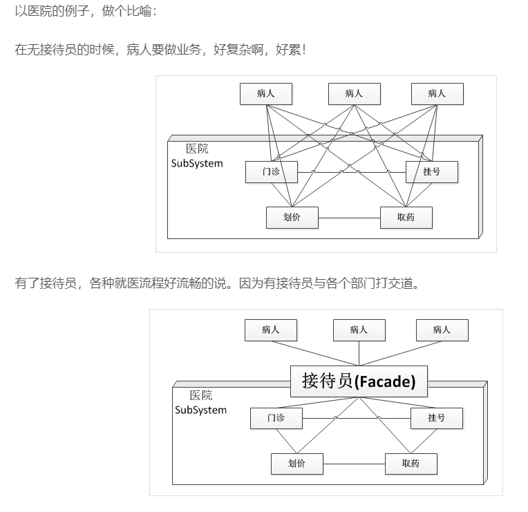

定义：为子系统中的一组接口提供一个一致的界面，Facade模式定义了一个高层接口，这个接口使得这一子系统更加容易使用。
就是说，Facade提供了一个统一的接口，掩盖下层系统的复杂性，用户用起来更加的方便。

门面模式的优点：

●松散耦合

门面模式松散了客户端与子系统的耦合关系，让子系统内部的模块能更容易扩展和维护。

●简单易用

门面模式让子系统更加易用，客户端不再需要了解子系统内部的实现，也不需要跟众多子系统内部的模块进行交互，只需要跟门面类交互就可以了。

●更好的划分访问层次

通过合理使用Facade，可以帮助我们更好地划分访问的层次。有些方法是对系统外的，有些方法是系统内部使用的。把需要暴露给外部的功能集中到门面中，这样既方便客户端使用，也很好地隐藏了内部的细节