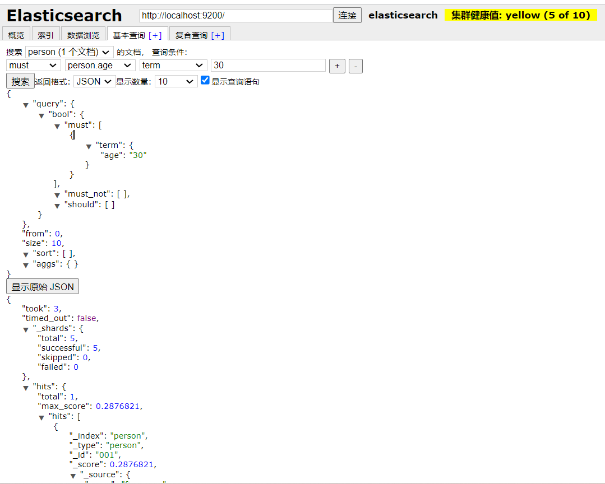

# 版本 6.8.13

---

# 索引

## 添加索引

PUT http://localhost:9200/person

```json
{
  "mappings": {
    "person": {
      "dynamic": "strict",
      "properties": {
        "name": {
          "type": "text"
        },
        "age": {
          "type": "keyword"
        }
      }
    }
  }
}
```

## 删除索引

DELETE /person
---

# 文档

# 添加文档:

POST http://localhost:9200/person/_doc/001

```json
{
  "name": "five_year",
  "age": "30"
}
```

# 查询文档

## 文档id查询

GET http://localhost:9200/person/_doc/001

## 字段查询

GET http://localhost:9200/person/_search

```json
{
  "query": {
    "term": {
      "age": "30"
    }
  }
}
```

```json
{
  "query": {
    "match": {
      "name": "year"
    }
  }
}
```



---
 
